# 🚀 CI/CD & DevOps: Guestbook Migration Project


**Author:** [Your Name]

## 📋 Overview
This project demonstrates a complete **DevOps transformation** of a legacy 3-tier application (Guestbook). The application has been migrated from a dependency on OpenShift to a self-hosted **Kubernetes (Kind)** cluster on a VPS, managed by a robust **CI/CD pipeline**.

---

## 🏗️ Architecture & Solution

### 🔍 The Challenge: "Why not OpenShift?"
The initial requirement was to deploy to OpenShift. However, we faced significant geographical and access limitations to the platform.
*   **Problem**: No access to the educational OpenShift cluster.
*   **Solution**: **"Build Your Own Platform"**. We architected a custom Kubernetes environment on a standard Linux VPS using **Kind** (Kubernetes in Docker), effectively replicating the required orchestration capabilities.

### 🔄 The Migration Journey (OpenShift -> Standard K8s)
The project started as a legacy application tightly coupled to OpenShift's proprietary ecosystem. To migrate it to a generic VPS environment, I performed a complete re-platforming:

| OpenShift Component (Legacy) | Replaced With (VPS/Standard K8s) | Reason |
|-----------------------------|----------------------------------|--------|
| **Routes** | **Nginx Ingress** | Standard Kubernetes mechanism for exposing services. |
| **ImageStreams** | **GitHub Container Registry** | Decoupling image management from the cluster. |
| **Source-to-Image (S2I)** | **Dockerfiles + GitHub Actions** | Full control over the build process via CI/CD. |
| **Templates** | **Plain K8s Manifests** | Removing template dependency for GitOps compatibility. |

This transformation proves that the application can run on **any standard Kubernetes** cluster, not just OpenShift.

### 🧩 Infrastructure Diagram
The solution uses Nginx Ingress Controller to route traffic, effectively replacing OpenShift Routes, while Cert-Manager handles SSL automation.


---

## � Security & CI/CD Configuration (Deep Dive)

A critical component of this project is the **secure, headless authentication** between GitHub and the Infrastructure. We avoided hardcoded credentials entirely.

### 1. SSH Handshake (GitHub -> VPS)
To allow GitHub Actions to execute commands on the VPS without a password, we implemented asymmetric cryptography:
*   **Key Generation**: We generated an ED25519 key pair (`ssh-keygen -t ed25519`).
*   **Trust Establishment**:
    *   The **Public Key** was added to the VPS's `~/.ssh/authorized_keys`.
    *   The **Private Key** was encrypted and stored as `VPS_SSH_KEY` in GitHub Secrets.
*   **Execution**: The `appleboy/ssh-action` uses this key to open a secure tunnel, executing the deployment script as if a user were typed it at the terminal.

### 2. Registry Authentication (GHCR)
We implemented a strict "Private Registry" policy.
*   **Push (CI)**: The workflow uses the short-lived `GITHUB_TOKEN` to authenticate and push images during the build phase.
*   **Pull (CD)**: The Kubernetes cluster needs a permanent way to pull these private images. We generated a **Personal Access Token (PAT)** with `read:packages` scope and stored it as a Kubernetes Secret:
    ```bash
    # Secret creation on VPS
    kubectl create secret docker-registry ghcr-secret \
      --docker-server=ghcr.io \
      --docker-username=mvulcu \
      --docker-password=[PAT_TOKEN]
    ```
    This secret (`ghcr-secret`) is then referenced in all Deployments via `imagePullSecrets`.

### 3. Secrets Management Strategy
All sensitive data is decoupled from the code.

| Secret Name | Scope | Purpose |
|-------------|-------|---------|
| `VPS_HOST` | GitHub | IP address of the production server. |
| `VPS_USER` | GitHub | SSH User (e.g., `ubuntu`). |
| `VPS_SSH_KEY` | GitHub | Private SSH Key for remote execution. |
| `GHCR_TOKEN` | GitHub | Token for pushing Docker images. |
| `db-secrets` | K8s | Internal DB/Redis passwords. |

---

## 🔄 CI/CD Pipeline Workflow

```mermaid
sequenceDiagram
    participant Dev as 👨‍💻 Developer
    participant GH as 🐙 GitHub Actions
    participant Reg as 📦 GHCR (Registry)
    participant VPS as 🖥️ VPS Server

    Dev->>GH: Push to main
    GH->>GH: Build Docker Images
    GH->>Reg: Authenticate & Push
    GH->>VPS: SSH Connect (RSA/ED25519)
    VPS->>GH: Git Pull (Manifests)
    VPS->>Reg: Authenticate (imagePullSecrets)
    VPS->>Reg: Pull Latest Images
    VPS->>VPS: kubectl apply & rollout restart
```



---

## 🔧 Deployment Configuration

The configuration was migrated from OpenShift Templates to standard Kubernetes Manifests:

| File | Purpose | Key Strategy |
|------|---------|--------------|
| `01-db.yaml` | Postgres & Redis | Uses Secrets for passwords. |
| `02-backend.yaml` | Go Backend | `imagePullPolicy: Always` ensures fresh code on restart. |
| `04-ingress.yaml` | Routing | Maps `guestbook.cicd.cachefly.site` to the frontend service. |
| `05-issuer.yaml` | SSL | Let's Encrypt Production Issuer. |

---

## 🧠 Q&A: Technical Decisions

### 1. Which YAML files are changed? Do we need to apply all?
In a strict GitOps flow, only the **Deployment** usually changes (specifically the `image` tag).
*   **Technically**: You only need to apply changed files.
*   **Our Strategy**: We run `kubectl apply -f k8s/kind/` for **all files**.
    *   *Reason*: Kubernetes is **declarative and idempotent**. Applying an unchanged file is a no-op (safe). applying everything ensures the cluster state matches the repository exactly, preventing "configuration drift".

### 2. If we change a ConfigMap, do we need to restart the Deployment?
**Yes.**
*   Pods read `ConfigMap` values (env vars) only at startup.
*   Changing the ConfigMap resource alone does not notify running Pods.
*   **Implementation**: Our deployment script includes `kubectl rollout restart deployment/...`. This gracefully spins up new Pods with the new configuration and terminates the old ones.

---

## 🚀 How to Run

### Deployment
One command handles everything (Cluster, Ingress, SSL, App):
```bash
sh scripts/deploy-kind.sh
```

**Live URL:** [https://guestbook.cicd.cachefly.site](https://guestbook.cicd.cachefly.site)
